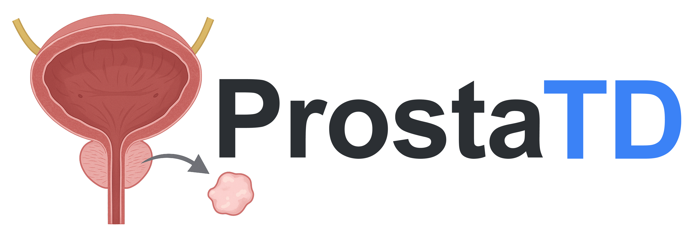
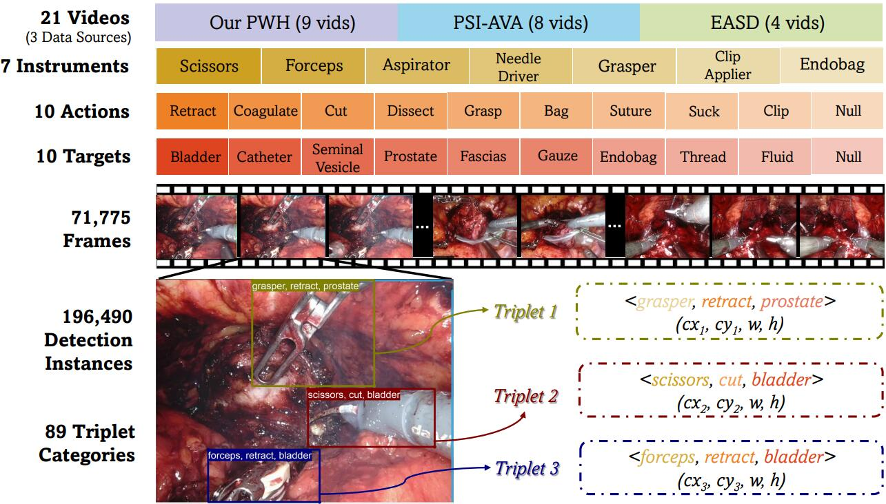
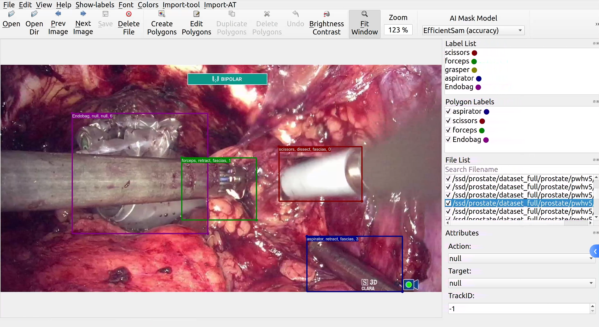
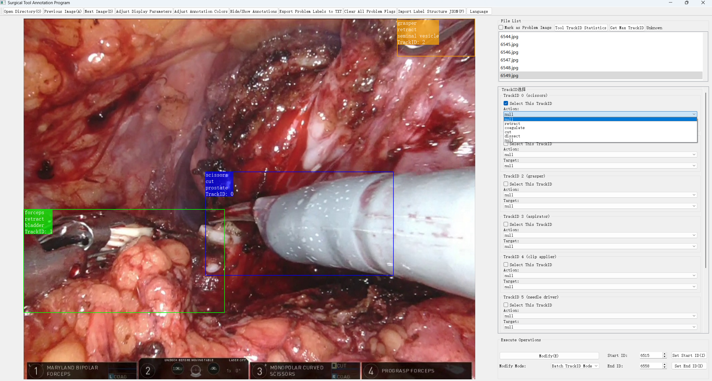

### 
### **ProstaTD: Bridging Surgical Triplet from Classification to Fully Supervised Detection**
ProstaTD is the first fully supervised surgical triplet detection dataset curated from 21 robot-assisted prostatectomy videos, collectively spanning full surgical procedures across multiple institutions, featuring 71,775 annotated frames with 196,490 structured surgical triplet instances (instrument-verb-target) that provide precise bounding box localization for all instruments alongside clinically validated temporal action boundaries. The dataset incorporates our in-house PWH dataset, the [ESAD](https://saras-esad.grand-challenge.org/download/) dataset and [PSI-AVA](https://github.com/BCV-Uniandes/TAPIR) dataset with our own added annotations (without using the original data annotations). It delivers instance-level annotations for 7 instrument types, 10 actions, 10 anatomical/non-anatomical targets, and 89 triplet combinations (excluding background).
<br/>

[](https://arxiv.org/pdf/2506.01130)

<div align="center">
  
</div><br/>

## 📑 Table of Content
1. [Download Dataset](#download-access)
2. [Dataset Preprocess](#%EF%B8%8F-preprocess)
3. [Annotation Software](#%EF%B8%8F-annotation-software)
4. [Evaluation Toolkit](ivtdmetrics/README.md)
   - [Installation](ivtdmetrics/#ivtd_installation)
   - [Evaluation Example](ivtdmetrics/#ivtd_example)
5. [Benchmark Methods](training/README.md)
   - [Library Installation](training/#bench_install)
   - [YOLO-based Mehtods](training/#bench_yolo)
   - [DETR-based Mehtods](training/#bench_detr)
6. [Postprocess Visualization](training/#postprocess)
  
## 🗂️ Dataset Format
(Taking Yolo format as an example)

Each instance within every frame of the dataset video contains following attributes: 

| Field Name    | Description                                                                 | Current Status |
|---------------|-----------------------------------------------------------------------------|----------------|
| Triplet ID    | Unique identifier for the (instrument, verb, target) triplet                | **Available**  |
| Instrument ID | Identifier for the instrument (subject) in the triplet                      | **Available**  |
| Verb ID       | Identifier for the action verb connecting instrument and target             | **Available**  |
| Target ID     | Identifier for the target (object) in the triplet                           | **Available**  |
| cx            | Normalized bounding box center x-coordinate (0-1 range)                     | *Pending*      |
| cy            | Normalized bounding box center y-coordinate (0-1 range)                     | *Pending*      |
| w             | Normalized bounding box width (0-1 range)                                   | *Pending*      |
| h             | Normalized bounding box height (0-1 range)                                  | *Pending*      |

**Key Notes:**
1. Available fields contain currently available data. 
2. Pending fields will be released upon acceptance.
3. All pending fields currently use placeholder value as empty set `∅` or `Null` in our json annotation file. 
4. Some frames were removed due to non-surgical scenes or adverse environmental factors (e.g., extreme reflection); overall, the frames are visually continuous​.

## ⚙️ Dataset Preprocess

To prepare the dataset, first go to the `preprocess` directory and run the following scripts:

```bash
# Step 1: enter the preprocess directory
cd preprocess

# Step 2: resize all images and json annotations to 640x640 while keeping aspect ratio
python resize_640.py

# Step 3a: convert Triplet-labelme format to COCO-format dataset (5 splits)
python build_coco_dataset_triplet_only.py

# OR

# Step 3b: convert Triplet-labelme format to YOLO-format dataset (5 splits)
python build_yolo_dataset_triplet_only.py
```

<a id="download-access"></a>
## 📥 Download Access

To request access to the ProstaTD Dataset, please fill out our [request form](https://forms.gle/W8aGcb5c48YCXV1L9).

**Important Notes:**  
🔹 **Recommended Email**: Advice use **Gmail**​​ for submission (other emails may find the reply in spam folders).  
🔹 **Response Time**: If you haven't received access instructions within **one hour**, please send a follow-up email to us with subject "ProstaTD Access Request - [Your Name]". We'll manually process your request and send the download link within **2 business days**. 

Some classification results of our ProstaTD (Prostate21) can be found at [SurgVISTA](https://arxiv.org/pdf/2506.02692)

## 📈 Evaluation Toolkit

To ensure fair comparison of model performance and to enable future evaluation across different surgical scenarios, we have also developed a dedicated **triplet detection evaluation toolkit**. This package provides consistent metrics and evaluation protocols tailored for **instrument–verb–target detection** tasks, helping the community to benchmark models under a unified standard.

For details, please check our **Evaluation Toolkit** at [ivtdmetrics folder](ivtdmetrics/README.md) in this repo.

## 🤖 Baseline Models and Training

We also provide several benchmarking models for training on our dataset, which can serve as baseline implementations. These baselines are intended to facilitate future research and development by offering reference code and reproducible pipelines. They provide a starting point for building improved methods in structured surgical triplet detection.

For details, please check **the models** at [training folder](training/README.md) in this repo.

## 🖌️ Annotation Software

<table>
  <tr>
    <td><center></center></td>
    <td><center></center></td>
  </tr>
  <tr>
    <td><center>Our Triplet-labelme annotation tool</center></td>
    <td><center>Our SurgLabel annotation tool</center></td>
  </tr>
</table>

We have developed two customized annotation tools to facilitate structured surgical triplet labeling tasks:

1. Triplet-labelMe Annotation Tool 
This tool is built upon the open-source [LabelMe](https://github.com/wkentaro/labelme) framework, specially adapted for **bounding box annotation** and **instrument type labeling**.  
In addition to standard functionalities, it supports direct modification of **single triplet annotations** (instrument, action, target, bbox).  
We have also introduced a series of convenient enhancements, such as:  
- Default auto-save  
- More intuitive shortcut key definitions  
- Flexible visual customization (color schemes, label transparency, font and line thickness)  
- Fixes for several long-standing bugs in LabelMe that previously caused crashes or invalid operations  
- Versatile other surgical tasks
- ...

2. SurgLabel Annotation Tool 
This tool is designed for **batch annotation of actions and targets**, with support for both bounding box and segmentation modes.  
It also provides a rich set of personalization and utility features, including:  
- Customizable colors, fonts, line thickness, and transparency 
- Multi-language support  
- Statistical data summaries for annotation analysis  
- Enhanced user-friendly workflows optimized for large-scale annotation
- Versatile other surgical tasks
- ...
  
*Both tools will be released with the final version of the paper.*

## 🙏 Acknowledgement
Part of the codes are borrowed from [mmdetection](https://github.com/open-mmlab/mmdetection), [ultralytics](https://github.com/ultralytics/ultralytics), [detectron2](https://github.com/facebookresearch/detectron2), [LabelMe](https://github.com/wkentaro/labelme).

## 📜 License
This repository is available for non-commercial scientific research purposes as defined in the [CC BY-NC-SA 4.0](https://creativecommons.org/licenses/by-nc-sa/4.0/) with additional [ethical requirement](./LICENSE).

## Citation
```bibtex
@article{chen2025prostatd,
  title     = {ProstaTD: Bridging Surgical Triplet from Classification to Fully Supervised Detection},
  author    = {Yiliang Chen and Zhixi Li and Cheng Xu and Alex Qinyang Liu and Ruize Cui and Xuemiao Xu and Jeremy Yuen-Chun Teoh and Shengfeng He and Jing Qin},
  journal   = {arXiv preprint arXiv:2506.01130},
  year      = {2025}
}
```

